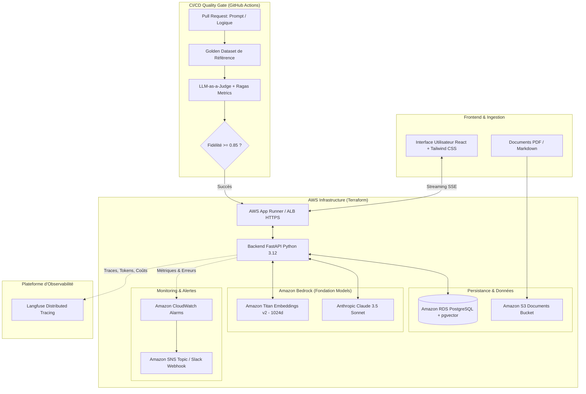

# 🚀 Production LLMOps Platform on AWS
### End-to-End Enterprise RAG • Automated CI/CD Evaluation Gate • Distributed Observability

[-orange?logo=amazon-aws)](https://aws.amazon.com/bedrock/)
[](https://www.terraform.io/)
[](https://github.com/pgvector/pgvector)
[](https://fastapi.tiangolo.com/)
[](https://react.dev/)
[](https://langfuse.com/)

---

## 🎯 Aperçu du Projet

Cette plateforme regroupe et implémente l'ensemble du cycle de vie d'une application d'**IA Générative en Production (LLMOps)** sur **Amazon Web Services (AWS)**.

Conçue selon les standards d'ingénierie logicielle les plus stricts, elle fusionne 3 composants critiques :
1. **Pipeline Advanced RAG de Production :** Ingestion documentaire, chunking sémantique récursif, embeddings normalisés via **Amazon Titan Embeddings v2**, stockage vectoriel avec index **HNSW** sur **PostgreSQL (`pgvector`)**, recherche hybride dense + sparse (BM25) via **Reciprocal Rank Fusion (RRF)**, reranking et génération contextuelle en streaming avec **Claude 3.5 Sonnet** sur **Amazon Bedrock**.
2. **Quality Gate CI/CD & Évaluation Automatisée :** Banc d'évaluation continue bloquant tout déploiement en cas de régression de qualité (seuil de fidélité anti-hallucination $\ge 0.85$, pertinence $\ge 0.70$) et notation qualitative via **LLM-as-a-Judge**.
3. **Observabilité, Télémétrie & Alerting :** Traçabilité distribuée de bout en bout avec **Langfuse** (latence TTFT, décomposition des temps de recherche, tokens consommés, calcul exact du coût en USD à chaque requête), collecte de feedback utilisateur (+1 / -1) et alertes **CloudWatch / SNS**.

---

## 🏗️ Architecture Globale



---

## 💎 Les 3 Piliers LLMOps Détaillés

### Pilier 1 : Advanced RAG avec Hybrid Search & Reranking
- **Ingestion & Chunking :** Découpage récursif avec préservation sémantique de 600 caractères et 100 caractères d'overlap.
- **Indexation vectorielle :** Index HNSW (`vector_cosine_ops`) garantissant des temps de réponse sous les 15 ms même sur de volumineux corpus.
- **Hybrid Search :** Combine les embeddings vectoriels et la recherche textuelle BM25 via l'algorithme RRF (*Reciprocal Rank Fusion*) :
  $$RRF\_Score(d) = \sum_{m \in \{dense, sparse\}} \frac{w_m}{k + rank_m(d)}$$
- **Garde-fous Anti-Hallucination :** Prompt système strict imposant la citation obligatoire de sources et interdisant toute extrapolation hors contexte.

### Pilier 2 : Automated Evaluation & CI/CD Quality Gate
- **Golden Dataset :** Cas de tests représentatifs avec vérités terrain et mots-clés obligatoires.
- **Métriques quantitatives :**
  - *Faithfulness (Fidélité au contexte)* : Détection automatique des affirmations non prouvées.
  - *Answer Relevancy (Pertinence de la réponse)* : Mesure de l'adéquation à l'intention utilisateur.
  - *Context Precision & Recall* : Vérification de la complétude du retrieval.
- **LLM-as-a-Judge :** Claude 3.5 évalue chaque réponse selon une grille de 1 à 5 avec verdict structuré JSON.
- **Blocage en CI/CD :** Exécuté sous GitHub Actions. Tout merge est bloqué si la fidélité chute sous le seuil configuré.

### Pilier 3 : Observabilité, Tracing & Détection de Dérive
- **Télémétrie distribuée :** Capture de l'arborescence complète (Query $\rightarrow$ Retrieval $\rightarrow$ Reranking $\rightarrow$ LLM Generation).
- **Calcul de coût en temps réel :** Calcul automatique basé sur les tarifs officiels Bedrock (Claude 3.5 Sonnet : \$0.003 / 1k input tokens, \$0.015 / 1k output tokens).
- **Boucle de feedback :** Corrélation directe des votes utilisateurs (+1 / -1) avec l'identifiant de trace dans Langfuse.
- **Alerting :** Alarmes CloudWatch sur les taux d'erreur 5xx et la latence p95, notifiant sur Slack via SNS.

---

## 🛠️ Stack Technique

| Domaine | Technologies |
|---|---|
| **Cloud Provider** | Amazon Web Services (AWS) |
| **Modèles LLM & Embeddings** | Amazon Bedrock (Anthropic Claude 3.5 Sonnet, Amazon Titan Embeddings v2) |
| **Infrastructure as Code (IaC)** | Terraform v1.8+ (VPC multi-AZ, RDS pgvector, S3, IAM, App Runner, CloudWatch) |
| **Base de Données Vectorielle** | PostgreSQL 16 + extension `pgvector` (Index HNSW) |
| **Backend & API** | Python 3.12, FastAPI, Pydantic Settings, Boto3, Rank-BM25, Uvicorn |
| **Frontend** | React 18, Vite, TypeScript, Tailwind CSS, Lucide Icons |
| **Observabilité & Tracing** | Langfuse (OpenTelemetry compatible), AWS CloudWatch, Amazon SNS |
| **CI/CD & Évaluation** | GitHub Actions, RAGAS, DeepEval, Pytest |

---

## 🚀 Démarrage Rapide

### 1. Prérequis
- Python 3.11+
- Node.js 20+
- Docker & Docker Compose
- Compte AWS avec accès activé à Amazon Bedrock (Claude 3.5 et Titan)
- Terraform v1.5+

### 2. Lancement en Local (Docker Compose)
```bash
git clone https://github.com/votre-compte/rag-llmops-aws.git
cd rag-llmops-aws

# Copier les variables d'environnement
cp terraform/terraform.tfvars.example terraform/terraform.tfvars

# Lancer la stack complète en conteneurs
make up
```
- **Interface React :** `http://localhost:3000`
- **Documentation API FastAPI :** `http://localhost:8000/docs`
- **Vérification de santé :** `http://localhost:8000/api/system/health`

### 3. Exécuter le Quality Gate d'Évaluation
```bash
# Lance le banc de test d'évaluation et génère eval_report.md
make eval
```

### 4. Déploiement sur AWS avec Terraform
```bash
cd terraform
terraform init
terraform plan
terraform apply
```

---

## 💼 Valorisation sur votre CV / Profil LinkedIn

Voici des points concrets prêts à être intégrés à votre CV :

> **AI / LLMOps Engineer — Architecture RAG & Observabilité Cloud (AWS, Bedrock, Terraform)**
> - *Conception et déploiement d'une plateforme RAG d'entreprise de bout en bout sur AWS avec Terraform (VPC multi-AZ, RDS PostgreSQL avec pgvector, S3 et AWS App Runner).*
> - *Optimisation du moteur de recherche documentaire via une recherche hybride dense (Titan Embeddings v2) + sparse (BM25) avec fusion RRF et reranking contextuel pour Claude 3.5 Sonnet.*
> - *Mise en place d'un Quality Gate CI/CD sous GitHub Actions évaluant automatiquement les régressions de prompts (Faithfulness $\ge 0.85$, Relevancy) à l'aide de métriques RAGAS et d'un LLM-as-a-Judge.*
> - *Intégration d'un système d'observabilité distribué avec Langfuse et CloudWatch : suivi de la latence p95, comptabilisation des coûts en USD par requête et gestion de boucles de feedback utilisateur.*
